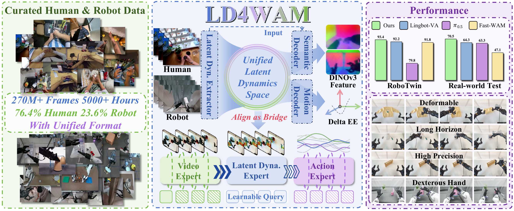

# LD4WAM: Learning Latent Dynamics from Human Videos for World Action Models

<p align="center">
  <a href="https://arxiv.org/abs/XXXX.XXXXX"></a>
  <a href="https://stubborn111.github.io/LD4WAM/"></a>
  <a href="Assets/LD4WAM.pdf"></a>
</p>

LD4WAM is a framework for learning robot manipulation from large-scale human and robot videos. It introduces motion-aligned latent dynamics: an embodiment-agnostic representation that connects visual dynamics learned from video with executable robot actions.

## Overview

<p align="center">
  
</p>

LD4WAM learns motion-aligned latent dynamics from unified human and robot data. The resulting representation serves as a bridge between the video expert and the action expert in a World Dynamics Action Model.

## Latent Dynamics Model (LDM)

## World Dynamics Action Model (WDAM)

WDAM is built on top of an upstream project. To align with that project's release schedule, the WDAM implementation will be released together with the corresponding upstream release. Stay tuned.

## Acknowledgements

This project is built upon [ViPRA](https://github.com/sroutray/vipra). We thank the authors for their work and for making the project available to the community.

## Citation

If you find LD4WAM useful, please consider citing:

```bibtex

```
